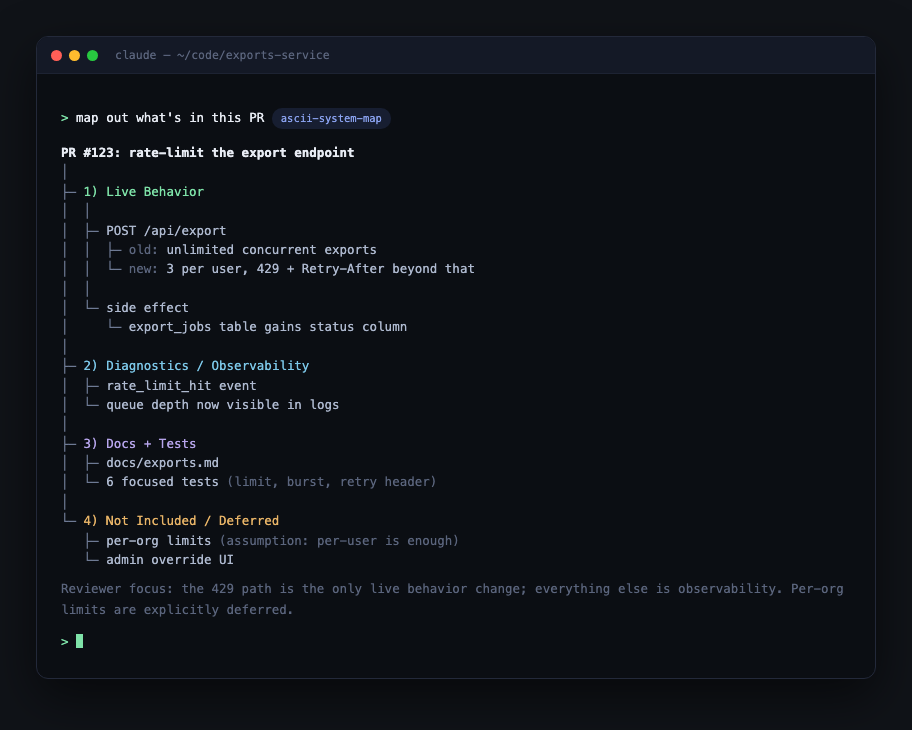

# ascii-system-map

An agent skill for Claude Code and Codex that turns any PR, endpoint, feature, or incident into a scannable ASCII scope map.



Instead of a wall of prose, it draws a plain-text tree: live behavior separated from docs, tests, and scaffolding, confirmed facts marked apart from assumptions. Paste it into a PR description, Slack thread, or review comment; it renders everywhere.

## Why

- **Scope at a glance.** What changes live behavior, what is just tooling, what is deferred.
- **Honest by design.** The skill refuses to invent components; inferred nodes are labeled as assumptions.
- **Reviewer-first.** A good map answers "what should I focus on?" before anyone opens a file.

## Install

```bash
git clone https://github.com/aviju888/ascii-system-map.git
```

Claude Code:

```bash
mkdir -p ~/.claude/skills/ascii-system-map
cp ascii-system-map/SKILL.md ~/.claude/skills/ascii-system-map/
```

Codex:

```bash
mkdir -p ~/.codex/skills/ascii-system-map
cp -R ascii-system-map/SKILL.md ascii-system-map/agents ~/.codex/skills/ascii-system-map/
```

## Use

The skill activates whenever you ask your agent for a scope map, PR map, ASCII diagram, or "what is included" breakdown:

```
map out what's in this PR
give me an ascii map of the /api/export call chain
visualize this incident: what's confirmed vs assumed
```

Ships with templates for PR scope maps and endpoint/call maps, plus a quality bar the output has to meet (no vague "misc changes" nodes allowed).

## License

MIT
